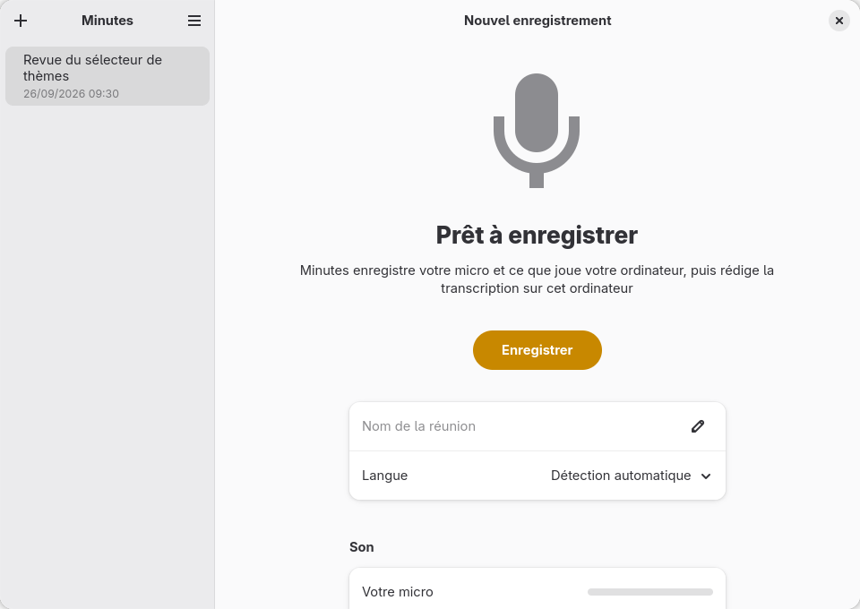
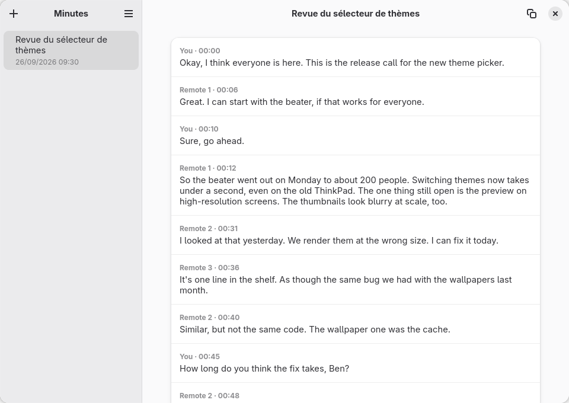

# Minutes

A meeting recorder and transcriber for GNOME. It records your microphone and what your computer plays as two tracks, and when the meeting ends you get a transcript with who said what, made on your own machine.

No bot joins the call and no audio leaves your computer. It works with Teams, Meet, Zoom or anything else that plays sound, because it listens to your devices, not to the meeting service.

> **Status: early.** The engine records, transcribes and tells speakers apart, and is tested. The GNOME app records, transcribes and shows the transcript; a Shell extension shows it in the top bar. It notices calls and offers to record them. Renaming speakers, playback and preferences are still to come.

<p align="center">&nbsp;</p>

## Where it comes from

Minutes starts from [omarchy-meeting-recorder](https://github.com/jankeesvw/omarchy-meeting-recorder) by Jankees van Woezik, a recorder built for Omarchy and Hyprland. Its engine is kept: two-track capture through PipeWire, echo removal, local transcription with [whisper.cpp](https://github.com/ggml-org/whisper.cpp), speaker diarization with NVIDIA's [Nemotron 3 Diarization](https://huggingface.co/nvidia/Nemotron-3-Diarization), crash recovery and the benchmark suite. The git history is kept too, so fixes made there can be brought here with `git cherry-pick`.

What Minutes changes:

- **A native GNOME app** in GTK 4 and libadwaita, following the GNOME Human Interface Guidelines, translated with gettext (English and French first).
- **A GNOME Shell extension**: recording state in the top bar, controls, and a notification when a transcript is ready.
- **Call detection**: when an app opens the microphone and plays sound for a while, Minutes offers to record. It asks; it does not start on its own, because the other people in the call have to know they are recorded.
- **Real names for the other side**, taken from the meeting app where it exposes them (Teams first), instead of "Remote 1" and "Remote 2".
- **GPU transcription on NVIDIA cards** through CUDA, and a glossary for names and jargon whisper gets wrong.

## Install

```bash
./install.sh                                   # for your user, in ~/.local
CUDAARCHS=86 ./install.sh --features cuda      # whisper on an NVIDIA GPU
./install.sh --autostart                       # also start in the background at login
./install.sh --uninstall
```

It installs the app with its launcher, icon and French translation, and the Shell extension, which shows up after you log out and back in. With `--autostart`, Minutes starts at login without a window and without touching the microphone: it only watches for calls, to offer recording them. The microphone is used while the window is open (for the meters) or a recording goes on; closing the window hides it and lets the microphone go.

## Build and run

```bash
cargo run --release -p minutes                                  # CPU
CUDAARCHS=86 cargo run --release -p minutes --features cuda     # NVIDIA GPU; set your card's compute capability
```

It needs PipeWire with `parec` and `pacat`, `ffmpeg` with libopus, GTK 4 and libadwaita 1.6 or newer, gettext, and Rust and CMake to build. The CUDA build needs the CUDA toolkit with `nvcc` on the `PATH`, recent enough for your GCC.

`minutes <meeting folder>` opens a meeting. `minutes transcribe <mic> <computer>` and `minutes transcribe-file <audio>` print a transcript as Markdown without opening a window.

## Preview during the call

While Minutes records, it writes a preview of the transcript as the call goes on: in the window under the meters, and in the top bar when you click the indicator. What someone is still saying shows greyed, redrawn every second, and turns into a line of its own once they pause. Replaying a two-minute call at its own pace, the grey draft ran a second behind the speech at most (90th percentile), and the finished lines 2.8 s (median).

It is rougher than the transcript made at the end: it finds speech on what has been heard so far, does not tell voices on one side apart, and gives whisper a window fitted to a few seconds of speech with one second try instead of four when a piece decodes badly. A line said again word for word among the last few on its side is dropped, since whisper sometimes gives back the text before it. Why a live transcript as good as the final one was not reached is measured on the `live-sim` branch, in `bench/LIVE.md`.

When you stop, the preview is saved at once as `transcript-preview.md` in the meeting folder, to copy or open while the real transcript is made, from the whole recording as before. That one replaces nothing: the preview stays in the folder.

It needs whisper on a GPU (the `cuda` or `vulkan` build). On the CPU the usual model is slower than the call, so there is no preview unless you set a smaller model for it:

```toml
live_model = "small"
```

## Nothing lost

If Minutes stops while it records (a crash, a logout, a power cut), the raw audio stays in `~/.cache`, and the next start shows a banner to write its transcript or delete it; started in the background, Minutes says so in a notification.

Each track keeps time on its own: when a device stops sending sound (a headset asleep or taken off), the time it missed is filled with silence, so the two sides stay in step, and the window says that your microphone sends nothing.

## Your data

Recordings and transcripts stay on your computer, in folders only your account can read: `~/Documents/Meetings` and the recordings in progress under `~/.cache` are created with mode `700`, since they hold the voices of people who did not choose where they are kept.

The speech models are downloaded from Hugging Face at a fixed revision, and each file is checked against its SHA-256 before it is used; a file that differs is refused and deleted.

## Alone at your microphone

Minutes tells apart the voices on each side, so that two people sharing your microphone come out as two. When you are alone at it, that can split your own voice in two as you move or as the room's sound mixes in; say so in the config and your side is one person, you:

```toml
alone_at_mic = true
```

## Muting your microphone

The **Mute My Microphone** button (in the window and in the top bar menu) records silence on your side while it is on: the track keeps its length, so the two sides stay in step. What you say while muted stays out of the preview and the transcript.

With Teams, Minutes can follow your mute button there too. Muting yourself in Teams only stops what Teams sends; your microphone still hears you, and so would Minutes. If Teams runs with a debugging port (teams-for-linux started with `--remote-debugging-port`), set it in the config:

```toml
teams_debug_port = 9222
```

Twice a second while recording, Minutes then reads the Teams window: whether you are muted there, your name, and who else is in the call. It only reads the page, never clicks or sends anything, and only when this is set, since that port gives full control of Teams. While you are muted in Teams your side is recorded as silence; and when a single other person is in the call, the preview and the transcript use their name and yours instead of "Others" and "You".

A Bluetooth headset such as AirPods only gives its microphone once an app switches it to its headset profile, as Teams does when a call starts; outside a call Minutes hears nothing from it, and does not switch it itself, since that would bring your music down to phone quality.

## Call detection

While Minutes runs, it looks at the PipeWire graph every three seconds. An app that both takes the microphone and plays sound for ten seconds is in a call: Teams, Meet in a browser, Zoom, without Minutes knowing any of them. A video (sound out only) or a voice memo (microphone only) is not. Minutes then shows a notification with a Record button, and reminds you to tell the others first; it never starts on its own. When the call it records ends, it stops and says so: after about fifteen seconds without the call's sound, or within two seconds of leaving a Teams call when it reads Teams (`teams_debug_port`).

## GNOME Shell extension

`extension/` shows in the top bar while Minutes records, is paused or writes a transcript: a red dot and the time, with a menu to pause, stop or open Minutes. It stays hidden the rest of the time. It reads Minutes' state over D-Bus (the `status` action of the app), so it needs nothing but Minutes running.

```bash
extension/build.sh --install                  # then log out and in
gnome-extensions enable minutes@gheop.github
```

## Layout

- `engine/`: recording, transcription, speakers and meeting folders, without GTK, so it runs and is tested without a display. `engine/src/session.rs` is one meeting from Start to transcript.
- `app/`: the GNOME app (GTK 4, libadwaita, translations in `app/po/`).
- `legacy/`: the interface Minutes was forked from, kept until the new one does everything it did. `bench/run.py` still runs its binary.
- `engine/src/calls.rs`: telling a call from the PipeWire graph, tested on graphs in `engine/tests/fixtures/pipewire/`.
- `extension/`: the GNOME Shell extension; `status.js` is what it shows for each state, apart from the Shell so it can be tested.
- `bench/`: transcript quality (`run.py`, with thresholds) and timing (`perf.py`); `PERF.md` has the numbers.

## Testing

```bash
cargo test --workspace --release        # the window test needs a display, and is skipped without one
gjs -m extension/tests/status.test.js   # what the top bar shows
extension/tests/shell-smoke.sh          # loads the extension into a GNOME Shell with no screen
bench/run.py --ami --check              # transcript and speaker quality against the thresholds
```

## Configuration

`~/.config/omarchy-meeting-recorder/config.toml` (the path moves when the app is renamed):

```toml
model = "large-v3-turbo"
prompt = "Budget review with Maya Okafor and Tom Lindqvist: the CAPEX, the SLA, Kubernetes."
fix = "Okafur => Okafor"
```

`prompt` tells whisper the names and words to expect; it only reads it for the first half minute or so, so a word it keeps getting wrong later needs a `fix` line, which replaces it in the finished transcript.

## License

MIT, like the project it comes from. See [LICENSE](LICENSE).

## Changelog

### v0.7.2 — A preview that keeps up (2026-09-27)

- The live preview no longer slows down as a call goes on: finding speech took a second per look after 16 minutes, it now takes a few milliseconds after an hour
- Its memory stays flat instead of growing with the length of the call
- The lines it writes are the same as before

### v0.7.1 — Safer data (2026-09-27)

- Models are downloaded at a fixed revision and refused unless their SHA-256 matches
- Meeting and recording folders are readable by your account alone
- Names read from Teams can no longer break or forge lines of a transcript

### v0.7.0 — Nothing lost (2026-09-27)

- A recording interrupted by a crash, a logout or a power cut is found at the next start, to recover or delete
- When a headset stops sending sound, the time it missed is filled with silence, so both sides stay in step
- The window says when your microphone sends nothing during a recording

### v0.6.1 — One voice at your microphone, names without the Participants panel (2026-09-26)

- `alone_at_mic = true` keeps your side as one person instead of splitting your voice in two
- With Teams, the other person's name is found on the stage when the Participants panel is closed
- Lines whisper invents on silence, like "Sous-titrage Société Radio-Canada", are left out
- The preview saved at Stop uses the names Teams gave

### v0.6.0 — The preview follows the speech (2026-09-26)

- What someone is still saying shows greyed in the preview, a second behind at most, and becomes a line once they pause
- Finished lines come about 2 to 3 seconds after the sentence ends
- Whisper runs about five times faster for the preview, and no longer repeats itself in it

### v0.5.0 — A faster preview, and stopping when the call ends (2026-09-26)

- The preview runs about 4 seconds behind the call instead of 10 to 20: it looks twice a second and cuts someone talking on at a pause
- The recording stops by itself when the call ends, within two seconds of leaving a Teams call
- With Teams, your name and the other person's are found even when the call view hides your profile picture

### v0.4.0 — Mute your microphone, here or in Teams (2026-09-26)

- **Mute My Microphone** records silence on your side, in the window and in the top bar menu
- With `teams_debug_port`, muting yourself in Teams mutes your side in Minutes too
- With Teams, the preview and the transcript show your name and the other person's in a call between two

### v0.3.0 — Installed, and waiting for calls in the background (2026-09-26)

- `install.sh` installs Minutes for your user, with its launcher, icon, translation and Shell extension
- `--autostart` starts Minutes at login in the background, to notice calls without a window
- The microphone is only in use while the window is open or a recording goes on
- Closing the window of a Minutes started in the background hides it; call detection goes on

### v0.2.0 — A preview of the transcript during the call (2026-09-26)

- While recording, a preview of the transcript is written a few seconds behind the call, in the window and in the top bar menu
- At Stop, the preview is saved at once, to copy or open while the final transcript is made
- The final transcript is still made from the whole recording, with the same quality as before
- `live_model` in the config sets a smaller model for the preview on computers without a GPU

### v0.1.0 — A GNOME app on the engine of omarchy-meeting-recorder (2026-09-26)

- New GNOME interface in GTK 4 and libadwaita: the meetings on the left; getting ready, recording, writing the transcript and reading it on the right
- In English and French
- A GNOME Shell extension shows the recording in the top bar, with pause and stop, and a notification says when the transcript is ready
- GPU transcription on NVIDIA cards with the `cuda` feature
- `prompt` and `fix` in the config for names and words whisper gets wrong
- Speakers are found only where someone speaks: a call is transcribed 15 to 30 % faster, with the same quality
- The whisper model loads while the speakers are found
- Call detection: an app that takes the microphone and plays sound is a call; Minutes offers to record it, and to stop when it ends
- No more "unknown language" warning when nothing was said
